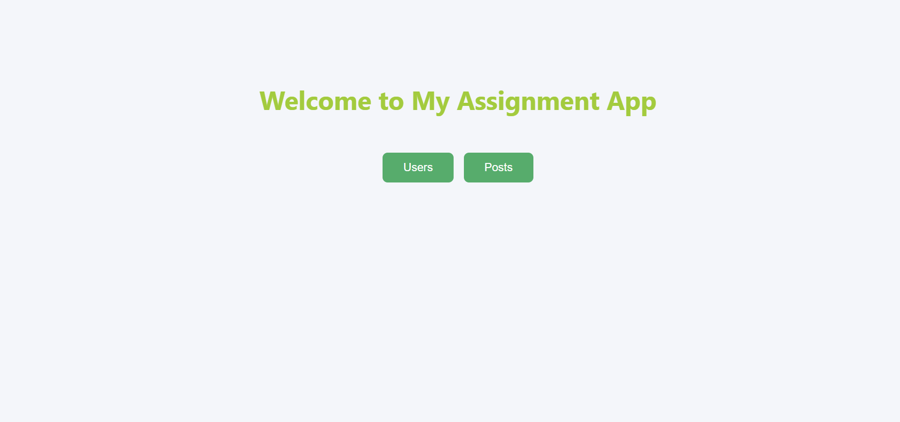
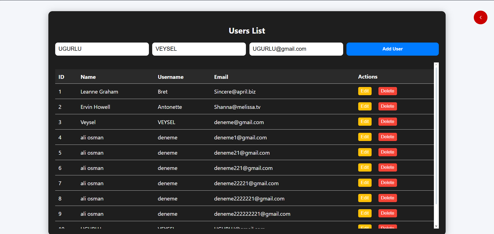

---

## `backend/README.md`

````markdown
# Backend - NestJS API

Bu proje, kullanıcılar (Users) ve gönderiler (Posts) ile ilgili CRUD işlemlerini
sağlayan basit bir REST API’dir. NestJS kullanılmıştır. Veriler şimdilik bellekte (in-memory) tutulmaktadır.

## Gereksinimler

- Node.js (>= 18)
- npm (>= 9)

## Kurulum

```bash
# Bağımlılıkları yükle
npm install

# Geliştirme ortamı
npm run start:dev

# Prod build
npm run build

npm run start:prod

# API Endpointleri
Users

GET /users → Tüm kullanıcıları getir

GET /users/:id → ID ile kullanıcı getir

POST /users → Yeni kullanıcı ekle

PUT /users/:id → Kullanıcı güncelle

DELETE /users/:id → Kullanıcı sil

Posts

GET /posts → Tüm postları getir

GET /posts/:id → ID ile post getir

POST /posts → Yeni post ekle

PUT /posts/:id → Post güncelle

DELETE /posts/:id → Post sil
```
````


